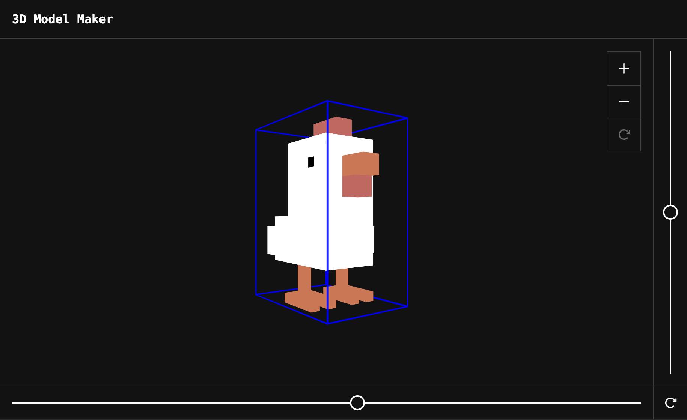

# 3D Model Maker

Simple tool to create pixelated 3D models buuilt using HTML and CSS.



## Getting Started

Run the development server:

```bash
npm run dev
```

Open [http://localhost:3000](http://localhost:3000) with your browser to see the result.
